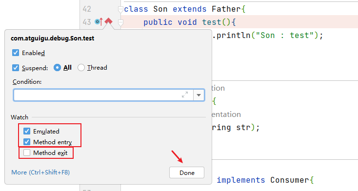
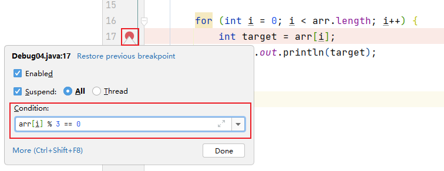
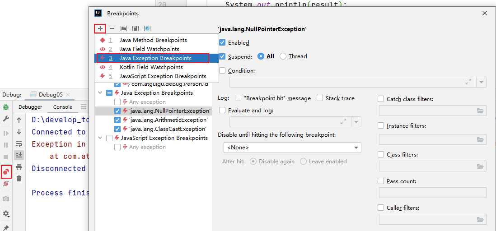

# 走进Java语言

一般来说，编程语言就分为两大类：

* **编译型语言：** 需要先编译为计算机可以直接执行的命令才可以运行。优点是计算机直接运行，性能高；缺点是与平台密切相关，在一种操作系统上编译的程序，无法在其他非同类操作系统上运行，比如Windows下的exe程序在Mac上就无法运行。
* **解释型语言：** 只需要通过解释器代为执行即可，不需要进行编译。优点是可以跨平台，因为解释是解释器的事情，只需要在各个平台上安装对应的解释器，代码不需要任何修改就可以直接运行；缺点是需要依靠解释器解释执行，效率肯定没直接编译成机器指令运行的快，并且会产生额外的资源占用。


那么我们来看看我们今天要介绍的主角，Java语言（Java之父：James Gosling，詹姆斯·高斯林）

> Write Once, Run Anywhere.

这是Java语言的标语，它的目标很明确：一次编写，到处运行，它旨在打破平台的限制，让Java语言可以运行在任何平台上，并且不需要重新编译，实现跨平台运行。

那么，Java语言是什么样的一个运行机制呢？

实际上Java程序也是需要进行编译才可以运行的，这一点与C语言是一样的，Java程序编译之后会变成**`.class`结尾**的**二进制文件**。

不过不同的是，这种二进制文件计算机并不能直接运行，而是需要交给JVM（Java虚拟机）执行。


JVM是个什么东西呢？简单来说，它就像前面介绍的解释器一样，我们可以将编译完成的`.class`文件直接交给JVM去运行，而程序中要做的事情，也都是由它来告诉计算机该如何去执行。

在不同的操作系统下，都有着对应的JVM实现，只需要安装好就可以了，而我们只需要将Java程序编译为`.class`文件就可以直接交给JVM运行，无论是什么操作系统，JVM都采用的同一套标准读取和执行`.class`文件，所以说我们编译之后，在任何平台都可以运行，实现跨平台。

由于Java又需要编译同时还需要依靠JVM解释执行，所以说Java**既是编译型语言，也是解释型语言。**

Java分为很多个版本：

* **JavaSE：** 是我们本教程的主要学习目标，它是标准版的Java，也是整个Java的最核心内容，在开始后续课程之前，这是我们不得不越过的一道坎，这个阶段一定要认真扎实地将Java学好，不然到了后面的高级部分，会很头疼。
* **JavaME：** 微缩版Java，已经基本没人用了。
* **JavaEE：** 企业级Java，比如网站开发，它是JavaSE阶段之后的主要学习方向。

# 环境安装与IDE使用

## JDK下载与安装

https://www.oracle.com/cn/java/technologies/downloads/

可选择不同版本，这里选择 JDK 17


## IDEA安装与使用

https://www.jetbrains.com.cn/idea/

建议安装中文插件

新建项目，自动识别到 JDK


### JKD 相关设置

`File-->Project Structure...-->Platform Settings -->SDKs`

### out目录和编译版本

`File-->Project Structure...-->Project Settings -->Project`

out 目录存放项目各模块编译后的 .class 文件


### 详细设置

`File-->Settings`

有关字体、背景、主题、文件编码等自行搜索设置


【修改类头的文档注释信息】

`File-->Settings-->Editor-->File and Code Templates-->Includes-->File Header`

例如

```java
/**
* ClassName: ${NAME}
* Package: ${PACKAGE_NAME}
* Description: 
* @Author XXX
* @Create ${DATE} ${TIME} 
* @Version 1.0   
*/
```

常用的预设的变量：

```
${PACKAGE_NAME} - the name of the target package where the new class or interface will be created. 
${PROJECT_NAME} - the name of the current project. 
${FILE_NAME} - the name of the PHP file that will be created. 
${NAME} - the name of the new file which you specify in the New File dialog box during the file creation. 
${USER} - the login name of the current user. 
${DATE} - the current system date. 
${TIME} - the current system time. 
${YEAR} - the current year. 
${MONTH} - the current month. 
${DAY} - the current day of the month. 
${HOUR} - the current hour. 
${MINUTE} - the current minute. 
${PRODUCT_NAME} - the name of the IDE in which the file will be created. 
${MONTH_NAME_SHORT} - the first 3 letters of the month name. Example: Jan, Feb, etc. 
${MONTH_NAME_FULL} - full name of a month. Example: January, February, etc.
```


### 项目与模块管理

#### IDEA 项目结构

```
project(工程) - module(模块) - package(包) - class(类)
```

一个project中可以创建多个module，一个module中可以创建多个package，一个package中可以创建多个class

#### Project 与 Module

IDEA 中Project是最顶级的结构单元，然后就是Module。目前，主流的大型项目结构基本都是多Module的结构，这类项目一般是`按功能划分`的，比如：user-core-module、user-facade-module和user-hessian-module等等，模块之间彼此可以`相互依赖`，有着不可分割的业务关系。因此，对于一个Project来说：

- 当为单Module项目的时候，这个单独的Module实际上就是一个Project。
- 当为多Module项目的时候，多个模块处于同一个Project之中，此时彼此之间具有`互相依赖`的关联关系。
- 当然多个模块没有建立依赖关系的话，也可以作为单独一个“项目”运行。

#### Package

在一个module下，可以声明多个包（package），一般命名规范如下：

```
1.不要有中文
2.不要以数字开头
3.给包取名时一般都是公司域名倒着写，而且都是小写
  比如：www.skyworth.com
  那么我们的package包名应该写成：com.skyworth.XXX
```

#### 创建/删除/导入 Mudule

创建/删除 略

导入先将别人的模块复制到项目的路径下，打开自己IDEA的项目，会在项目目录下看到拷贝过来的module，只不过不是以模块的方式呈现。File——Project Structure...——Project Settings——Import Module，一路 Next，最后选择 Overwrite。


### 代码模板的使用

设置-编辑器-常规-后缀补全，查看使用自定义

#### 查看Postfix Completion模板(后缀补全)

`File-->Settings-->Editor-->General-->Postfix Completion`

#### 查看Live Templates模板(实时模板)

`File-->Settings-->Editor-->Live Templates`

#### 常用代码模板

##### 1、非空判断

* 变量.null：if(变量 == null)
* 变量.nn：if(变量 != null) 
* 变量.notnull：if(变量 != null) 
* ifn：if(xx  == null)
* inn：if(xx  != null)

##### 2、遍历数组和集合

* 数组或集合变量.fori：for循环
* 数组或集合变量.for：增强for循环
* 数组或集合变量.forr：反向for循环
* 数组或集合变量.iter：增强for循环遍历数组或集合

##### 3、输出语句

- sout：相当于System.out.println
- soutm：打印当前方法的名称
- soutp：打印当前方法的形参及形参对应的实参值
- soutv：打印方法中声明的最近的变量的值
- 变量.sout：打印当前变量值
- 变量.soutv：打印当前变量名及变量值

##### 4、对象操作

- 创建对象
  - Xxx.new  .var ：创建Xxx类的对象，并赋给相应的变量
  - Xxx.new  .field：会将方法内刚创建的Xxx对象抽取为一个属性
- 强转
  - 对象.cast：将对象进行强转
  - 对象.castvar：将对象强转后，并赋给一个变量

##### 5、静态常量声明

* psf：public static final
* psfi：public static final int
* psfs：public static final String
* prsf：private static final

#### 自定义代码模板

##### 后缀补全模板

`File-->Settings-->Editor-->General-->Postfix Completion`

点击+号，选择Java

##### Live Templates

例如：定义sop代表System.out.print();语句

`File-->Settings-->Editor-->Live Templates`，点击右侧+号，选择 Template Group...，先定义一个模板的组，这样方便管理所有自定义的代码模板，在模板组里新建模板，点击右侧+号，选择 Live Template，填入：

- Abbreviation：模板的缩略名称
- Description：模板的描述
- Template text：模板的代码片段
- 模板应用范围。比如点击Define。选择如下：应用在java代码中。


### 快捷键

#### 常用快捷键

##### 1、IDEA的日常快捷键

第1组：通用型

| 说明            | 快捷键           |
| --------------- | ---------------- |
| 复制代码-copy   | ctrl + c         |
| 粘贴-paste      | ctrl + v         |
| 剪切-cut        | ctrl + x         |
| 撤销-undo       | ctrl + z         |
| 反撤销-redo     | ctrl + shift + z |
| 保存-save all   | ctrl + s         |
| 全选-select all | ctrl + a         |

第2组：提高编写速度（上）

| 说明                                               | 快捷键           |
| -------------------------------------------------- | ---------------- |
| 智能提示-edit                                      | alt + enter      |
| 提示代码模板-insert live template                  | ctrl+j           |
| 使用xx块环绕-surround with ...                     | ctrl+alt+t       |
| 调出生成getter/setter/构造器等结构-generate ...    | alt+insert       |
| 自动生成返回值变量-introduce variable ...          | ctrl+alt+v       |
| 复制指定行的代码-duplicate line or selection       | ctrl+d           |
| 删除指定行的代码-delete line                       | ctrl+y           |
| 切换到下一行代码空位-start new line                | shift + enter    |
| 切换到上一行代码空位-start new line before current | ctrl +alt+ enter |
| 向上移动代码-move statement up                     | ctrl+shift+↑     |
| 向下移动代码-move statement down                   | ctrl+shift+↓     |
| 向上移动一行-move line up                          | alt+shift+↑      |
| 向下移动一行-move line down                        | alt+shift+↓      |
| 方法的形参列表提醒-parameter info                  | ctrl+p           |

第3组：提高编写速度（下）

| 说明                                        | 快捷键       |
| ------------------------------------------- | ------------ |
| 批量修改指定的变量名、方法名、类名等-rename | shift+f6     |
| 抽取代码重构方法-extract method ...         | ctrl+alt+m   |
| 重写父类的方法-override methods ...         | ctrl+o       |
| 实现接口的方法-implements methods ...       | ctrl+i       |
| 选中的结构的大小写的切换-toggle case        | ctrl+shift+u |
| 批量导包-optimize imports                   | ctrl+alt+o   |

第4组：类结构、查找和查看源码

| 说明                                                      | 快捷键                          |
| --------------------------------------------------------- | ------------------------------- |
| 如何查看源码-go to class...                               | ctrl + 选中指定的结构 或 ctrl+n |
| 显示当前类结构，支持搜索指定的方法、属性等-file structure | ctrl+f12                        |
| 退回到前一个编辑的页面-back                               | ctrl+alt+←                      |
| 进入到下一个编辑的页面-forward                            | ctrl+alt+→                      |
| 打开的类文件之间切换-select previous/next tab             | alt+←/→                         |
| 光标选中指定的类，查看继承树结构-Type Hierarchy           | ctrl+h                          |
| 查看方法文档-quick documentation                          | ctrl+q                          |
| 类的UML关系图-show uml popup                              | ctrl+alt+u                      |
| 定位某行-go to line/column                                | ctrl+g                          |
| 回溯变量或方法的来源-go to implementation(s)              | ctrl+alt+b                      |
| 折叠方法实现-collapse all                                 | ctrl+shift+ -                   |
| 展开方法实现-expand all                                   | ctrl+shift+ +                   |

第5组：查找、替换与关闭

| 说明                                               | 快捷键       |
| -------------------------------------------------- | ------------ |
| 查找指定的结构                                     | ctlr+f       |
| 快速查找：选中的Word快速定位到下一个-find next     | ctrl+l       |
| 查找与替换-replace                                 | ctrl+r       |
| 直接定位到当前行的首位-move caret to line start    | home         |
| 直接定位到当前行的末位 -move caret to line end     | end          |
| 查询当前元素在当前文件中的引用，然后按 F3 可以选择 | ctrl+f7      |
| 全项目搜索文本-find in path ...                    | ctrl+shift+f |
| 关闭当前窗口-close                                 | ctrl+f4      |

第6组：调整格式

| 说明                                         | 快捷键           |
| -------------------------------------------- | ---------------- |
| 格式化代码-reformat code                     | ctrl+alt+l       |
| 使用单行注释-comment with line comment       | ctrl + /         |
| 使用/取消多行注释-comment with block comment | ctrl + shift + / |
| 选中数行，整体往后移动-tab                   | tab              |
| 选中数行，整体往前移动-prev tab              | shift + tab      |

##### 2、Debug快捷键

| 说明                                                  | 快捷键        |
| ----------------------------------------------------- | ------------- |
| 单步调试（不进入函数内部）- step over                 | F8            |
| 单步调试（进入函数内部）- step into                   | F7            |
| 强制单步调试（进入函数内部） - force step into        | alt+shift+f7  |
| 选择要进入的函数 - smart step into                    | shift + F7    |
| 跳出函数 - step out                                   | shift + F8    |
| 运行到断点 - run to cursor                            | alt + F9      |
| 继续执行，进入下一个断点或执行完程序 - resume program | F9            |
| 停止 - stop                                           | Ctrl+F2       |
| 查看断点 - view breakpoints                           | Ctrl+Shift+F8 |
| 关闭 - close                                          |               |


### Debug调试

#### Debug的步骤

##### 1、添加断点

在源代码文件中，在想要设置断点的代码行的前面的标记行处，单击鼠标左键就可以设置断点，在相同位置再次单击即可取消断点。


##### 2、启动调试

IDEA提供多种方式来启动程序(Launch)的调试，分别是通过菜单(Run –> Debug)、图标(“绿色臭虫”)等等


##### 3、单步调试，观察变量和执行流程，找到并解决问题


或


：Step Over（F8）：进入下一步，如果当前行断点是调用一个方法，则不进入当前方法体内

：Step Into（F7）：进入下一步，如果当前行断点是调用一个自定义方法，则进入该方法体内

：Force Step Into（Alt +Shift  + F7）：进入下一步，如果当前行断点是调用一个核心类库方法，则进入该方法体内

：Step Out（Shift  + F8）：跳出当前方法体

：Run to Cursor（Alt + F9）：直接跳到光标处继续调试

：Resume Program（F9）：恢复程序运行，但如果该断点下面代码还有断点则停在下一个断点上

：Stop（Ctrl + F2）：结束调试

：View Breakpoints（Ctrl + Shift  + F8）：查看所有断点

：Mute Breakpoints：使得当前代码后面所有的断点失效， 一下执行到底 

> 说明：在Debug过程中，可以动态的下断点。

#### 多种Debug情况介绍

##### 行断点

- 断点打在代码所在的行上。执行到此行时，会停下来。

##### 方法断点

- 断点设置在方法的签名上，默认当进入时，断点可以被唤醒。
- 也可以设置在方法退出时，断点也被唤醒



- 在多态的场景下，在父类或接口的方法上打断点，会自动调入到子类或实现类的方法


##### 字段断点

- 在类的属性声明上打断点，默认对属性的修改操作进行监控


##### 条件断点

例如在满足arr[i] % 3 == 0的条件下，执行断点。



##### 异常断点

- 对异常进行跟踪。如果程序出现指定异常，程序就会执行断点，自动停住。

通过下图的方式，对指定的异常进行监控：




##### 线程调试


##### 强制结束


